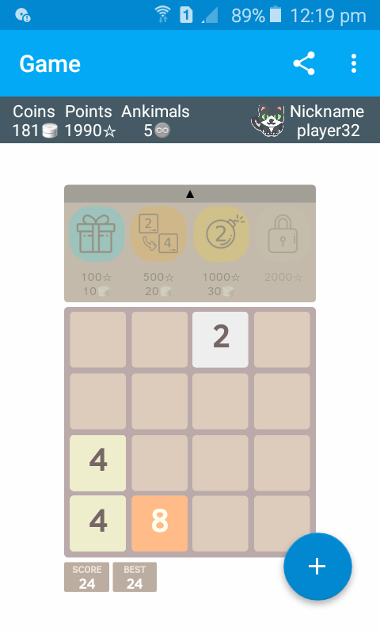
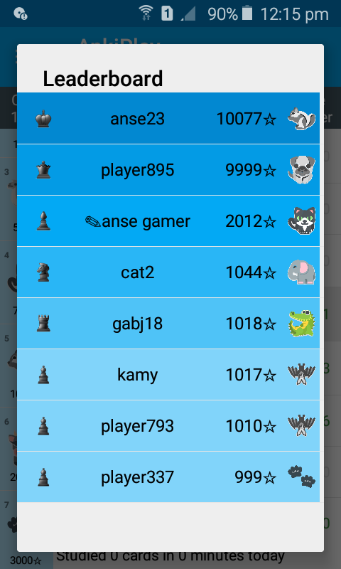
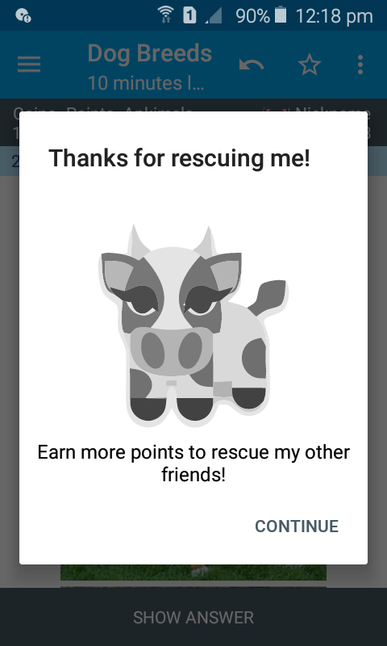

## Gamifying Spaced Repetition Software
### Sebastian Velasquez (s1700260)

### Goal
Gamify AnkiDroid and analyse user engagement.

### Methods
Gamifying AnkiDroid requires to modify the current application in a way that integrates various game schemes and elements. These modifications are meant to make the application more appealing for users. Once the modifications are done, the application has to be evaluated in a study. The study requires the participation of users to try the application over a period of time. The study allows to gather information about the usage of the application. Moreover, additional information is collected from participants in the form of surveys. Then, the information is analysed in the context of user engagement to draw conclusions about the proposed solution and further work.

### Progress
I started the project by prototyping an application that integrates AnkiDroid and a casual game. The objective of this integration was to set the stage for the implementation of game elements. To do so, the game was modified to allow that the users utilize tricks to make it easier as seen in **Figure 1**. Then, AnkiDroid was also modified to allow users earn game points and coins to unblock and use the tricks. In addition, other game schemes were implemented in AnkiDroid including a leaderboard and badges as shown in **Figure 2** and **Figure 3**.

**Figure 1: Modified game to include tricks**

**Figure 2: Leaderboard**

**Figure 3: Badges**

In order to evaluate the integration of a casual game as a means to motivate the usage of AnkiDroid, two versions of the application were created. The main difference between both versions is the integration of the game; one of the versions does not integrate it. All the other game elements and schemes were kept in both versions. Then, the versions were given to two independent groups of participants to use them. The participants have been informed about the duration of the study and the information that will be collected from the application. The study started on June 18, and it will end on July 16.

### Remaining steps
After the study ends, the information from the application and the survey will be analysed. The analysis will be based on comparisons of both versions of the application. These comparions will serve to draw conclusions about the effectiveness of each one of the strategies used to gamify AnkiDroid.
