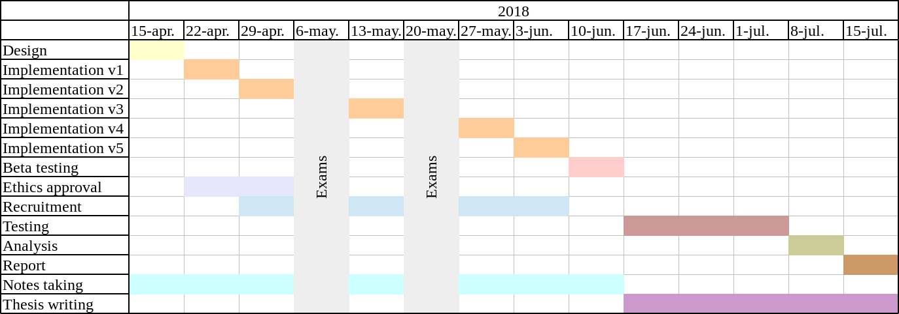

# Gamefying Spaced Repetition Software on Android
Dissertation project for the Msc in Artificial Intelligence at the University of Edinburgh (2018).

## Evaluation
The main objective of the project is to make spaced repetition more fun, so it is more appealing to the users. Based on this the evaluation must to be done in terms of engagement. Engagement is something complex to measure and evaluate. Previous work (O'Brien, H. L., & Toms, E. G. (2010)) has proposed a survey to measure engagement. This is a general purpose technique.

For the current project, it is necessary to first define engagement in terms of the objectives of the project. Since this work is a combination of gamification and space repeition. The engagement should be measured not only on how appealing the application is to users, but also on how well they perform when learning new concepts. 

Several type of data needs to be collected while the users use the application. Initially, one of the metrics of measurement in the time spent using the application. But, based on how the gamification is going to be implemented, other metrics can be defined. Also, the number of new facts learned need to be collected to perform an overall evaluation.

## Gamification implementation
There are several elements and startegies from games that can be included in the solution to increase the engagement of users. Some of the are the following:

- Badges
- Points
- Progress
- Goals

The plan is to use this elements and strategies to combine both components AnkiAndroid and the game. How the interaction with AnkiAndroid can be using during the game?

## Plan
