## Specifications for AnkiGame
### Version with connection
#### 1. Game
- The main logic of the game (**Classic mode**) is the same as in the original version:
  - The game starts with two tiles of value 2 randonmly positioned in the 4x4 grid.
  - The tiles in the 4x4 grid can be moved vertically or horizontally. 
  - The tiles stop when reaching a border, or colliding with other tiles. 
  - Colliding tiles that have the same value merge into a single one. 
  - The value of the new tile formed by two merging tiles is the sum of values of those tiles.
  - Every time the tiles move, a new tile of value 2 is put in the grid in a random position.
  - The game ends in the following conditions:
    - All the spots in the grid are filled with tiles and no more movements are possible (lose)
    - A tile of value 2048 is created (win).
  - The game can continue after creating the tile with the value 2048.
  - The score of the game is increased with the value of every new tile formed by two merging tiles. It is updated in every turn.
  - The best score is the highest score obtained by the user. It is updated at the end of the game.

- Another version of the game (**Match the tile mode**) has the following criteria:
  - The game starts with two tiles randonmly positioned in the 4x4 grid.
  - The value of the first tile is 2. The value of the second tile is 512.
  - The objective of the game is to create another tile of value 512 and merge it with the initial tile of value 512 using the smallest possible number of movements.
  - There is an initial number possible movements. At every turn, that number is decreased by 1.
  - The game ends in the following conditions:
    - All the spots in the grid are filled with tiles and no more movements are possible (lose)
    - The the initial tile of value 512 is merged with another one (win).
    - The number of possible movements is 0 (lose or win depending on the previous conditions).
  - The game does not continue after merging the initial tile of value 512.
  - The difficulty of the game might be increased by using the logic from [here](https://aj-r.github.io/Evil-2048/"), where the new tile in every turn is positioned in the worst possible spot.
  - The final score of the game depends on the number of remaining movements as well.

- A set of **tricks** to ease the game with the following characteristics:
  - *Bomb*: 
    - Destroys all tiles in the grid with number 2.
  - *Gift*: 
    - Puts a special tile in the grid that merges with a tile of any value lower than 512.
  - *Undo*:
    - Undoes the last movement.
    - Can't be used at start.
  - *Doubler*:
    - Doubles the value of the 2, 4, 8 and 16 tiles in the grid.
  - *10 turns*:
    - Increases the number of available movements in **Match the tile mode** by 10.
    - Not available in **Classic mode**.
  - Just a single trick can be used in every turn.
  - Each trick has a price (number of game coins). A trick can't be used if the number 
of available game coins is not enough to buy it.

- The game can be restarted at any point after confirmation.
- The game has the following sounds:
  - *Matching tiles* ([see](https://github.com/gabrielecirulli/2048/issues/117))
  - *Game over*
  - *Win*
  - *Using a trick*
- The game has an initial number of available game coins.
- The game can disable sounds.
- The game has a counter for the number of turns.
- At the end of the game, the application informs the position in the leaderboard.

#### 2. Anki
- The main logic of Anki is maintained, the following features might not be needed
  - **Decks screen**:
    - Left side bar icon.
    - Sync icon in the top bar.
    - More options menu.
    - Plus button to add new decks.
    - Dialog when long tap in decks.

  - **Flashcard screen**:
    - Left side bar icon.
    - More options menu.
    - Undo and fav options.

  - **Deck info screen**:
    - Configurations button in the top bar.
    - More options menu.

  - **Custom study dialog (when tapping "Study more")**:
    - Deck options.
    - More.

- Each revised card grants a number of game coins.
- The same card can be revised several times in a session. However, game coins are not granted every time. This has to be revised based on the logic of Anki.
- The session ends with an optional quizz that grants game coins based on the correct answers.
- The session quizz displays the cards that are still part of the learning phase. This has to be revised since it depends on the logic of Anki.
- Anki provides an score based on the revisions and results of the quizz.
- The number of coins are updated in every revised card and during the quizz

#### 3. Connection
- The leaderboard ranks the users based on the scores of the game modes and the score in Anki.
- The application can change contexts at any point, the user decides it.

#### 4. Extras
- The application displays daily notifications to remember the user to use it.
- At the end of the study, the users receives a notification to take the final test. The test is not mandatory, but the users are encouraged to take it in different ways. The final test is the same used in the initial stage.
- The landing context of the application is the game.
- The first time the user decides to earn points, he has to take the initial test. **This might not be neccesary**
- Multiple revisions are allowed, but in each revision on the same day, the application displays new cards.
- The application has a help page with useful information of the current screen.
- The application allows to set a nickname and an avatar.

#### 5. Data logging
- The application needs to log events and other type of information for further analysis. 
- The logs include the time and date.
- Starting a game logs the following information:
  - Best score.
  - Number of coins.
  - Game mode.
  - Current position in the leaderboard.
- Ending a game logs the following information:
  - Best score.
  - Current score.
  - Number of coins.
  - Number of coins utilised in the session.
  - Game mode.
  - Number of times tricks were utilised in the session.
  - Position in the leaderboard.
- Using a trick logs the following information:
  - Trick type.
  - Best score.
  - Current score.
  - Tiles and their values.
  - Current position in the leaderboard.
  - Number of coins.
  - Number of moves (Match the tile mode.)
- Changing the game mode logs the following information:
  - Best score.
  - Current score.
  - Tiles and their values.
  - Current position in the leaderboard.
  - Number of coins.
  - Previous game mode.
  - Selected game mode.
- Checking the leaderboard logs the following information:
  - Best score.
  - Current score.
  - Tiles and their values.
  - Current position in the leaderboard.
  - Number of coins.
  - Game mode.
- Restarting the game logs the following information:
 - Best score.
 - Current score.
 - Tiles and their values.
 - Current position in the leaderboard.
 - Number of coins.
 - Number of coins utilised in the session.
 - Number of times tricks were utilised in the session.
 - Game mode.
- Changing the context from game to Anki logs the following information:
 - Best score.
 - Current score.
 - Tiles and their values.
 - Current position in the leaderboard.
 - Number of coins.
 - Number of coins utilised in the session up to then. 
 - Number of times tricks were utilised in the session up to then.
 - Game mode.
- Changing the context from Anki to game logs the following information:
 - Number of coins.
 - Number of earned coins.
- Taking a quizz logs the following information:
 - Number of cards in the revision.
 - Correct and incorrect answers.
- Anki already has a database with useful information that can be retrieved.

### Version with independent contexts
#### 1. Game
- There are no game coins.
- Tricks can be used at will.

#### 2. Anki
- No game coins granted.
- No score.

#### 3. Connection
- No leaderboard.

#### 4. Extras
- The landing context of the application is Anki.

### Screen sketches

The following screens serve as references for the user interface of the application; they do not represent the final feel and look.

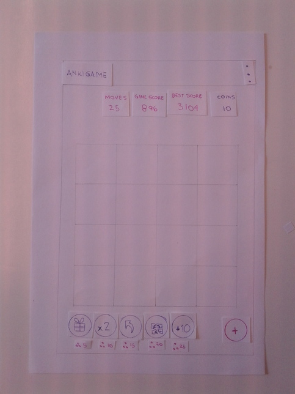
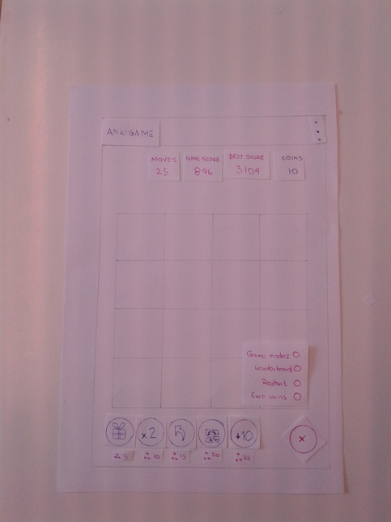
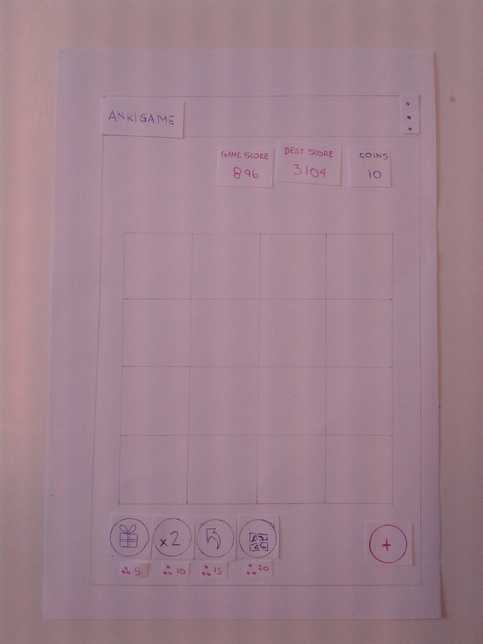
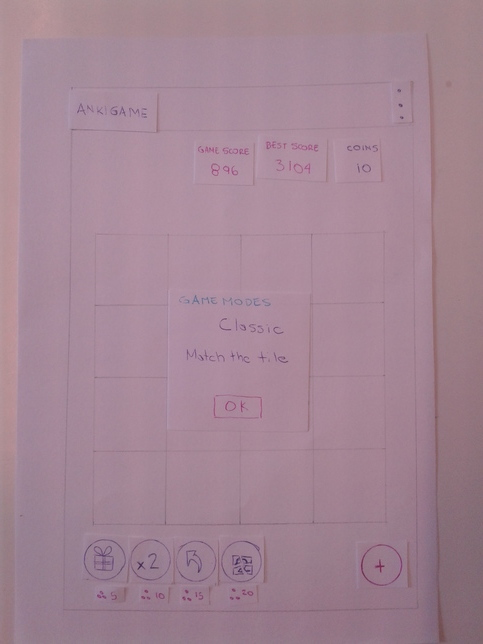

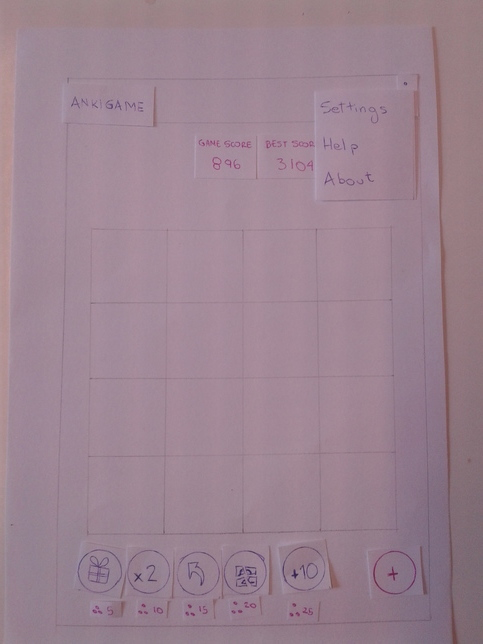
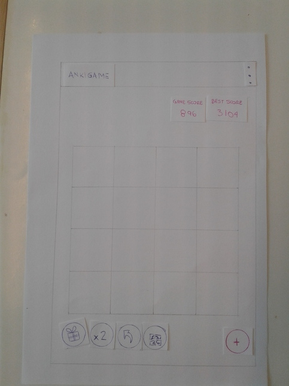
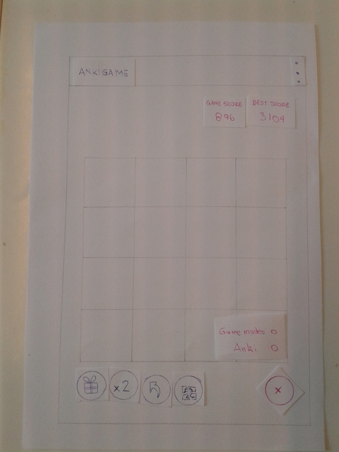
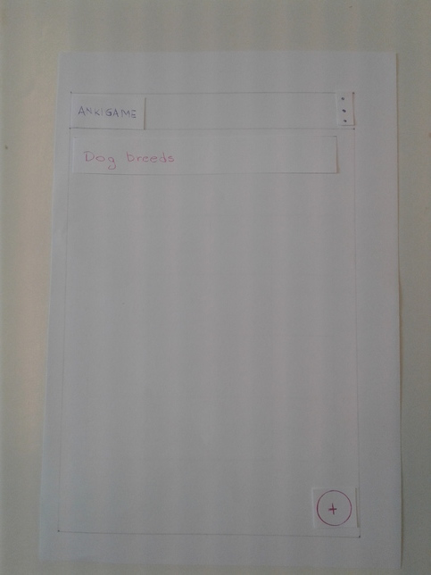
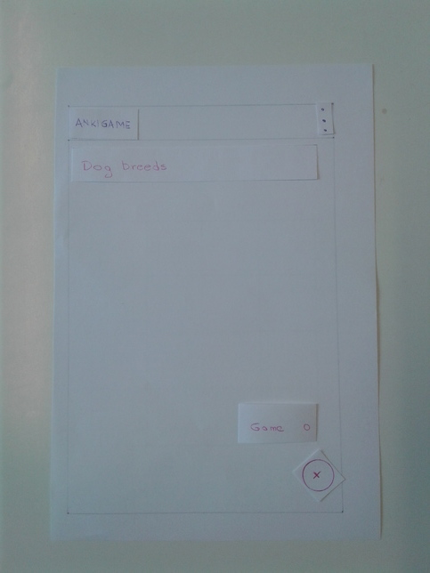
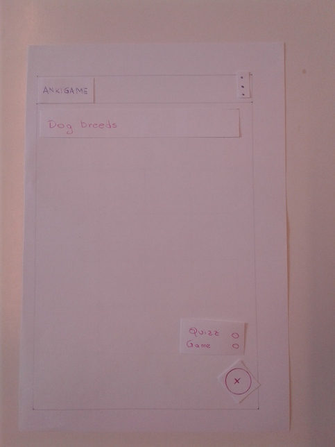
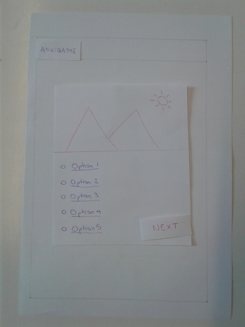